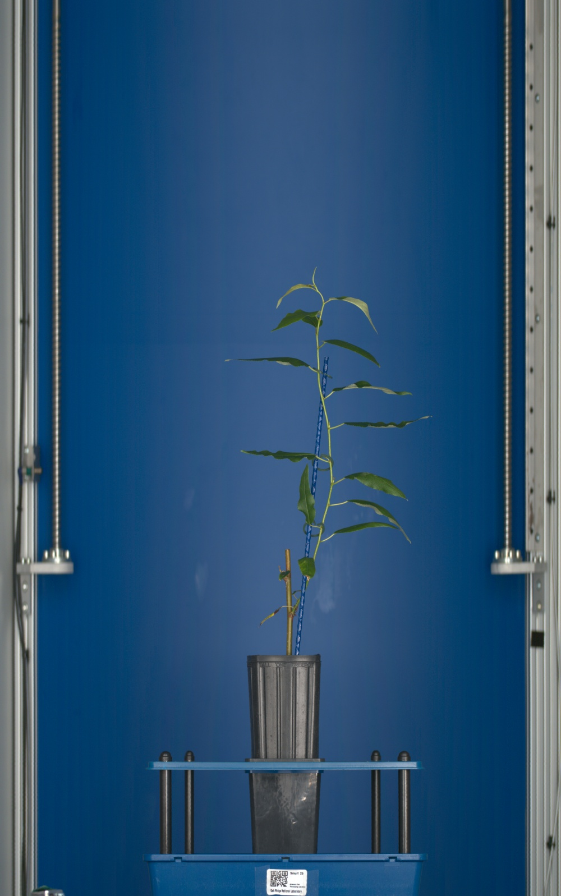
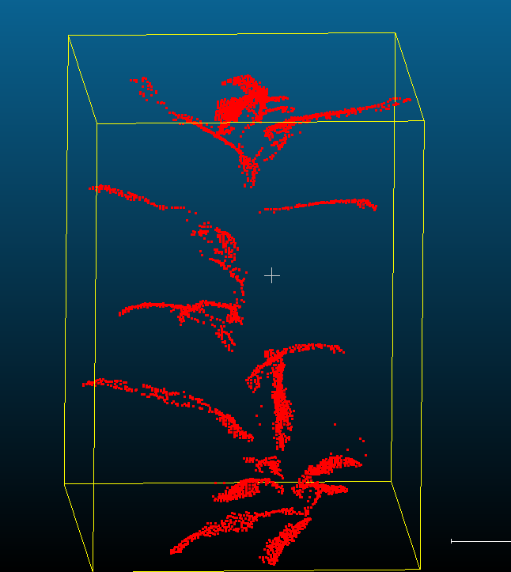
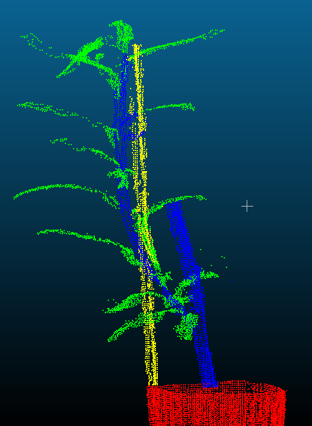
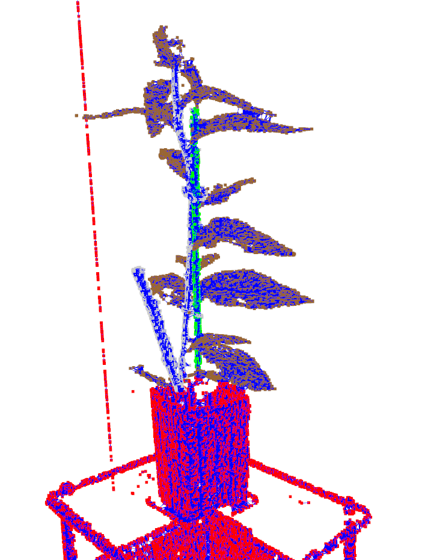
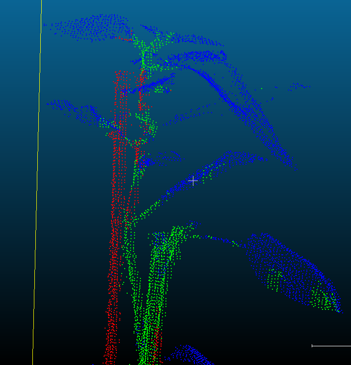

# Plant Organ Segmentation for Phenotyping via Geometric Deep Learning on 3D Point Clouds

### Authors

**Angel A. Barrera-Gomez**  
M.S. Applied Data Science  
B.E. Computer Systems Engineering  
Department of Mathematics & Statistics  
East Tennessee State University  

**Inhwan Jung**  
M.S. Applied Data Science  
Department of Mathematics & Statistics  
East Tennessee State University  

**Luke Hussung**  
M.S. Applied Data Science  
Department of Mathematics & Statistics  
East Tennessee State University  

---

### Academic Advisors

**Dr. Jeff R. Knisley**  
Department of Mathematics & Statistics  
East Tennessee State University  

**Dr. Michele Joyner**  
Department of Mathematics & Statistics  
East Tennessee State University  

**Dr. Robert M. Price**  
Department of Mathematics & Statistics  
East Tennessee State University  

In collaboration with **Oak Ridge National Laboratory (ORNL)**.  
December 2025

---

## Overview

This repository contains research code developed to study **semantic segmentation of 3D plant point clouds** using geometric supervised deep learning techniques. The project focuses on separating biologically meaningful plant organs, **Stem, Leaf, and Support Stake**, from high-resolution LiDAR scans collected at the Advanced Plant Phenotyping Laboratory (APPL) at Oak Ridge National Laboratory.

The work was conducted as part of the graduate course **STAT 5920 – Internship Experience in Data Science II** at East Tennessee State University and represents an academic research collaboration rather than a deployed production system.

---

## Research Motivation

High-throughput plant phenotyping is critical for bioenergy and agricultural research, yet traditional 2D imaging approaches struggle to capture volumetric and structural traits of complex, woody plants. LiDAR-based 3D point clouds offer rich geometric information but introduce challenges related to:

- Geometric ambiguity between biological and abiotic structures.
- Severe class imbalance (e.g., stems vs. leaves).
- Lack of spectral (RGB) information.
- Occlusion and sparse sampling at early growth stages.

This project investigates whether **explicit geometric feature engineering combined with Dynamic Edge Convolutional Neural Networks (DECNNs)** can effectively address these challenges.

<p align="center">
  <br>
  <em>Figure 1: Example 3D LiDAR scan of a young plant acquired in a controlled phenotyping environment. The resulting point cloud captures fine-grained geometric structure but lacks spectral information, motivating the need for geometry-aware learning methods.</em>
</p>


---

## Scope and Limitations

**Important Notice**

- No data is included in this repository.  
- All raw and processed point cloud data, labels, and metadata provided by ORNL are excluded due to confidentiality and intellectual property restrictions.  
- The code is shared **for research and methodological demonstration purposes only**.

Any results shown here are conditional on the specific dataset, annotation protocol, and experimental setup described in the accompanying documentation.

---

## Methodology Summary

### Manual Annotation Protocol

A structured, rule-based manual annotation protocol was developed using **CloudCompare** to label individual point clouds into the following semantic classes:

- Stem  
- Leaf  
- Support Stake  
- Background  

The protocol emphasizes:

- Complete coverage (every point assigned a class). 
- Priority on accurate stem segmentation.
- Consistent naming conventions.
- Careful handling of organ overlap and occlusion.

A total of **30 point clouds** were fully annotated to support supervised learning.


<p align="center">
  
  
</p>

<p align="center">
  <em>Figure 2: Examples of manually annotated 3D plant point clouds used for supervised training. Points are labeled into stem, leaf, support stake, and background classes following a rule-based annotation protocol.</em>
</p>

---

### Feature Engineering

Raw XYZ coordinates alone were insufficient to distinguish flat leaves from cylindrical stems and stakes. To enrich the input representation, local geometric descriptors were computed using a **radius-based (ε-neighborhood) approach**, where each point aggregates information from neighboring points within a fixed spatial radius.

The engineered features include:

- Linearity  
- Planarity  
- Sphericity  
- Relative Height  

These features capture local shape characteristics at a physically meaningful scale, which is critical for organ-level discrimination in LiDAR point clouds.

---

### Model Architecture

The primary model implemented is a **Dynamic Edge Convolutional Neural Network (DECNN)**, which:

- Constructs local neighborhood graphs dynamically at each layer.
- Learns edge features capturing local geometric relationships.
- It is well-suited for unstructured point cloud data.

To address severe class imbalance, a composite loss function combining **Weighted Cross-Entropy and Dice Loss** was used.

---

### Evaluation Strategy

Model performance was evaluated using:

- Intersection over Union (IoU).
- Recall and Precision (per class).
- Sample-averaged metrics.
- Bootstrapped confidence intervals.

Qualitative evaluation was performed via 3D visualizations of predicted segmentations to analyze structural reconstruction and failure modes.

---

## Repository Structure

The project is organized to strictly separate **raw data ingestion**, **model logic**, and **execution drivers**, ensuring reproducible and corruption-free training cycles.

```text
├── data/
│   ├── test/                 # Single .txt file for unseen testing
│   ├── train/
│   │   ├── raw/              # Source .txt label files
│   │   └── processed/        # Generated .pt tensors
│   └── val/
│       ├── raw/
│       └── processed/
│
├── models/                   # Best model weights saved by train.py
├── predictions/              # Output .pcd files for CloudCompare visualization
├── other_scripts/            # Experimental and exploratory scripts
│
├── src/
│   ├── dataset.py            # ETL pipeline and feature engineering
│   ├── model.py              # Dynamic Edge CNN architecture definition
│   └── inference.py          # Inference and post-processing logic
│
├── validations/              # EDA and data integrity checks
│   ├── check_data.py         # Dataset consistency validation
│   ├── check_labels.py       # Label integrity and class distribution checks
│   └── count_nans.py         # Numerical stability and NaN detection
│
├── train.py                  # Training loop and experiment configuration
├── evaluation.py             # Metric auditing and bootstrapped evaluation
├── visualization.py          # Visualization utilities
└── README.md

```
---

## Results (Illustrative)

Under the described experimental setup, the model achieved:

- Strong segmentation performance on the dominant Leaf class.  
- High recall for the critical Stem class despite severe class imbalance.  
- Meaningful reconstruction of primary plant structure in qualitative analysis.  

Observed limitations include stem–stake ambiguity and resolution-induced boundary artifacts, which are discussed in detail in the accompanying report.

<p align="center">
  
  
</p>

<p align="center">
  <em>
    Figure 3: Qualitative comparison of DECNN segmentation results. 
    <strong>Left:</strong> Early-stage model output prior to fine-tuning, illustrating high-frequency noise and fragmented predictions.
    <strong>Right:</strong> Final model prediction after feature engineering and hyperparameter tuning, showing coherent reconstruction of plant organs.
  </em>
</p>

---

## Future Research Directions

Potential extensions of this work include:

- Incorporation of RGB or multispectral data to reduce geometric ambiguity.  
- Higher-resolution training enabled by improved hardware resources.  
- Expanded datasets across growth stages and environmental conditions.  
- Comparative studies with alternative point cloud architectures.  

---

## Acknowledgments

This research used resources of the **Advanced Plant Phenotyping Laboratory** and the **Center for Bioenergy Innovation (CBI)**, which is a U.S. Department of Energy Bioenergy Research Center supported by the Office of Biological and Environmental Research in the DOE Office of Science. Oak Ridge National Laboratory is managed by **UT-Battelle, LLC** for the U.S. Department of Energy under Contract Number **DE-AC05-00OR22725**.

---

## Disclaimer

The views and conclusions contained in this repository are those of the authors and do not necessarily represent the views of Oak Ridge National Laboratory or the U.S. Department of Energy. The code is provided for academic and research purposes only.
