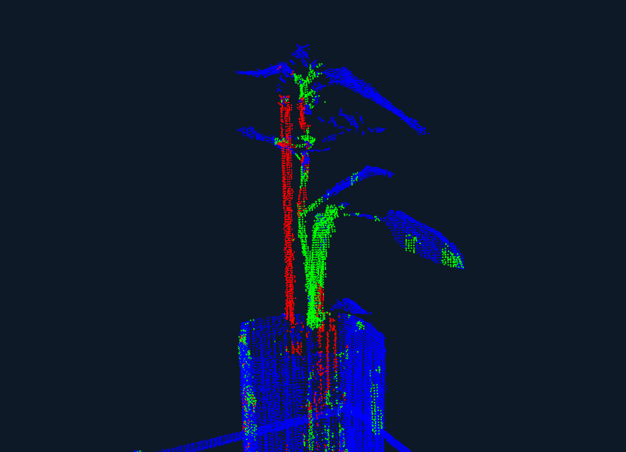

# Plant Organ Segmentation from 3D LiDAR Point Clouds via Geometric Deep Learning


  

_Last updated: December 18, 2025_

<div align="center">

### Authors

**[Angel A. Barrera-Gomez](https://www.linkedin.com/in/angomezu/)**, **[Inhwan Jung](https://www.linkedin.com/in/INHWAN_LINKEDIN/)**, **[Luke Hussung](https://www.linkedin.com/in/luke-hussung-4a2671252/)**  

**External Research Collaboration**  
**[Oak Ridge National Laboratory (ORNL)](https://www.ornl.gov/)**  

</div>

<p align="center">
  
</p>
<p align="center">
  <em>Figure 1: Final model prediction after feature engineering and hyperparameter tuning, showing coherent reconstruction of plant organs (65.58% mIoU, 82% stem recall).</em>
</p>

---

## Table of Contents

- [Abstract](#abstract)
- [Repository Purpose](#repository-purpose)
- [Contributions](#contributions)
- [Getting Started](#getting-started)
- [Code Structure](#code-structure)
- [Method Overview](#method-overview)
- [Problem Setting](#problem-setting)
- [Manual Annotation Protocol](#manual-annotation-protocol)
- [Geometric Feature Engineering](#geometric-feature-engineering)
- [Learning Architecture](#learning-architecture)
- [Evaluation Protocol](#evaluation-protocol)
- [Qualitative Findings](#qualitative-findings)
- [Future Research Directions](#future-research-directions)
- [Citation](#citation)
- [External Research Collaborators](#external-research-collaborators) 
- [Academic Advisors](#academic-advisors)
- [Acknowledgments](#acknowledgments)
- [Disclaimer](#disclaimer)

---

## Abstract

<div style="
  max-width: 1100px;
  margin: auto;
  text-align: justify;
  text-justify: inter-word;
  line-height: 1.6;
">
Semantic segmentation of unstructured 3D point clouds remains a challenging problem, particularly in domains where appearance cues are unavailable. In plant phenotyping, LiDAR-based point clouds provide rich geometric information but suffer from class imbalance, occlusion, and geometric ambiguity between biological and abiotic structures. This work investigates the use of geometry-aware deep learning for organ-level plant segmentation using Dynamic Edge Convolutional Neural Networks (DECNNs). We propose a structured annotation protocol, geometric feature augmentation, and a loss formulation tailored to highly imbalanced plant data. The released code focuses on methodology and reproducibility and accompanies an ongoing research manuscript. Our goal with this applied research project is to demonstrate how computer vision tools have a direct impact on industry problems such as 3D perception, robotics, autonomous systems, medical imaging, and industrial and agricultural inspection.
</div>
  
---

## Repository Purpose

This repository releases **research code** developed in collaboration with **Oak Ridge National Laboratory** for studying semantic segmentation of 3D plant point clouds.

**Important:**  
- No raw or processed data is included.  
- No trained model checkpoints are provided.  
- The repository focuses on **methodology, architecture, and evaluation**.

---

## Contributions

- Geometry-based semantic segmentation of plant organs from 3D LiDAR point clouds.  
- A structured manual annotation protocol tailored to complex biological structures.  
- Integration of local geometric descriptors within dynamic graph convolutional networks.  
- Robust learning under severe class imbalance in organ-level segmentation tasks.  
- A research-oriented, modular codebase designed to support reproducible experimentation.

---

## Getting Started

### Installation

Please follow the [installation guide](assets/docs/INSTALL.md). To run the pipeline end-to-end make sure to install dependencies, place labeled point clouds in `data/train` and `data/val`,
train with `python train.py`, then evaluate with `python evaluation.py` and visualize with `python visualization.py`.

---

## Code Structure

The repository is organized as a modular research pipeline:

```text
├── data/                # Directory structure only (no data included)
│   ├── train/
│   ├── val/
│   └── test/
│
├── src/
│   ├── dataset.py       # ETL and geometric feature computation
│   ├── model.py         # Dynamic Edge CNN architecture
│   └── inference.py     # Inference and post-processing
│
├── validations/         # Data integrity and sanity checks
│   ├── check_data.py
│   ├── check_labels.py
│   └── count_nans.py
│
├── train.py             # Training loop
├── evaluation.py        # Metric computation and bootstrapping
├── visualization.py    # 3D visualization utilities
└── README.md
```

All directories related to raw data, predictions, and model checkpoints are **intentionally excluded** from this repository to comply with data confidentiality and intellectual property constraints associated with Oak Ridge National Laboratory (ORNL).

---

## Method Overview

### Problem Setting

Given a 3D LiDAR point cloud acquired in a controlled phenotyping environment, the goal is to assign each point a semantic label corresponding to biologically meaningful plant structures:

- **Stem**
- **Leaf**
- **Support Stake**
- **Background**

The task is challenging due to:
- Severe class imbalance.
- Structural similarity between stems and stakes.
- Occlusion and sparse sampling.
- Absence of RGB or spectral information.

---

### Manual Annotation Protocol

High-quality ground truth is critical for supervised semantic segmentation of 3D point clouds, particularly in plant phenotyping where geometric ambiguity, occlusion, and class imbalance are prevalent. To ensure consistent, accurate, and reproducible labels, a **structured manual annotation protocol** was developed using **CloudCompare**.

The protocol defines a rule-based workflow for point-wise segmentation and labeling of LiDAR point clouds into four semantic classes: **stem**, **leaf**, **stake**, and **background**. It enforces strict completeness, naming conventions, boundary rules, and class assignment guidelines, ensuring that every point in the original scan is assigned a biologically meaningful label.

This annotation strategy was essential for:
- Producing reliable supervision signals for deep learning.
- Reducing label noise in geometrically ambiguous regions.
- Enabling consistent evaluation across samples.
- Supporting reproducibility and future dataset extensions.

A total of 30 fully annotated 3D LiDAR point clouds were generated and used for supervised training and evaluation.

The full annotation procedure, including setup instructions, segmentation steps, labeling rules, and export formats, is documented in detail here: [Manual Annotation Protocol](assets/docs/3D_Plant_Segmentation_Protocol.pdf)

---

### Geometric Feature Engineering

To overcome the limitations of raw XYZ coordinates, each point is augmented with local geometric descriptors computed within a fixed-radius neighborhood:

- Linearity  
- Planarity  
- Sphericity  
- Relative Height  

These features encode local shape properties critical for organ discrimination.

---

### Learning Architecture

The core model is a **Dynamic Edge Convolutional Neural Network (DECNN)** that:

- Dynamically constructs neighborhood graphs per layer.
- Learns edge features capturing local geometry.
- Operates directly on unstructured point clouds.

To address extreme class imbalance, training uses a composite loss combining:

- Weighted Cross-Entropy  
- Dice Loss  

---

### Evaluation Protocol

Model performance is evaluated using:

- Intersection over Union (IoU).
- Precision and Recall (per class).
- Sample-averaged metrics.
- Bootstrapped confidence intervals.

Qualitative evaluation is performed via 3D visualization of predicted segmentations.

---

## Qualitative Findings

Under the described experimental setup:

- Strong performance is observed on the dominant **Leaf** class.
- High recall is achieved for the biologically critical **Stem** class.
- Qualitative results show coherent reconstruction of plant structure.

Limitations include stem–stake ambiguity and boundary artifacts due to resolution constraints.

For a comprehensive discussion of experimental results, quantitative metrics, and additional analyses, please refer to the full exit report available here: [Exit Report](assests/docs/ORNL_DECNN_Exit_Report.pdf)

---


## Future Research Directions

Potential extensions of this work include:

- Incorporation of RGB or multispectral information to reduce geometric ambiguity
- Evaluation of alternative point cloud architectures (e.g., PointNet++, KPConv, transformer-based models)
- Temporal modeling across plant growth stages
- Scalable experimentation via containerization and MLOps workflows (e.g., Docker, experiment tracking, automated evaluation pipelines)

---

## Citation

If you find this work useful in your research, please consider citing:

```bibtex
@unpublished{barrera2025plantseg,
  title  = {Plant Organ Segmentation from 3D LiDAR Point Clouds via Geometric Deep Learning},
  author = {Barrera-Gomez, Angel A. and Jung, Inhwan and Hussung, Luke},
  year   = {2025}
}
```
---
## External Research Collaborators 
**Oak Ridge National Laboratory (ORNL) | Biosciences Division**

**Dr. John Lagergren**  
R&D Associate Staff Member  
lagergrenjr@ornl.gov  

**Dr. Larry M. York**  
Senior Staff Scientist  
yorklm@ornl.gov  

**Anand Seethepalli**  
Biosciences Computer Vision Developer  
seethepallia@ornl.gov  

---

## Academic Advisors
**East Tennessee State University (ETSU) | Department of Mathematics & Statistics**

**Dr. Jeff R. Knisley**  
Professor  
knisley@etsu.edu  

**Dr. Robert M. Price**  
Professor  
pricer@etsu.edu  

**Dr. Michele Joyner**  
Professor  
joynerm@etsu.edu  

---

## Acknowledgments

This research used resources of the Advanced Plant Phenotyping Laboratory and the Center for Bioenergy Innovation (CBI), which is a U.S. Department of Energy Bioenergy Research Center supported by the Office of Biological and Environmental Research in the DOE Office of Science. Oak Ridge National Laboratory is managed by UT-Battelle, LLC for the U.S. Department of Energy under Contract Number DE-AC05-00OR22725.

We sincerely thank **Dr. John Lagergren**, **Dr. Larry M. York**, and **Anand Seethepalli** (Oak Ridge National Laboratory, Biosciences Division) for providing access to experimental data, domain expertise, and valuable feedback throughout the project. We also thank **Dr. Jeff R. Knisley**, **Dr. Robert M. Price**, and **Dr. Michele Joyner** (Department of Mathematics & Statistics, East Tennessee State University) for their academic guidance and mentorship, and for making this collaboration possible by enabling meaningful real-world research and development experience in data science.

---
## Disclaimer

The views and conclusions expressed in this repository are those of the authors and do not necessarily represent the views of Oak Ridge National Laboratory or the U.S. Department of Energy. The code is provided for **academic and research purposes only**.
